# Flows

The paths a request actually takes today, with the modules and functions that
implement each one. For where code lives and why, see
[ARCHITECTURE.md](ARCHITECTURE.md).

Every flow starts the same way, so it is stated once here rather than repeated:

`api/__init__.py` exposes the same turn twice — `POST /api/v1/agent/chat`
(`chat`, one JSON envelope) and `POST /api/v1/agent/chat/stream`
(`chat_stream`, NDJSON: coarse status lines then that same envelope, flow 11).
Both open the turn (`observability.start_turn`), verify the bearer token through
`auth.verify_supabase_access_token`, refuse a body `user_id` that disagrees with
it (403), parse any action form via `api/actions.py:action_payload`, and open
**one** MCP session for the whole turn (`mcp_client/session.py:mcp_session`)
before dispatching. A structured action is dispatched identically on both routes
(`_route_request`), so the two cannot disagree about what an action does.

**No phrase-to-tool or phrase-to-view routing happens anywhere.** There is
exactly one query route. `agent/policy.py` performs only a fail-closed scope and
safety check; deciding what an accepted banking query needs is the model's job.
`api/query_routing.py`,
`agent/retrieval.py`, `a2ui_actions/routing.py` and
`intents.classify_financial_request` no longer exist, and neither does any
"deterministic financial fast path".

**Invariant for all flows:** `current_user_id` comes from the token and nothing
else, and `mcp_client/trusted_scope.py:enforce_trusted_user_scope` overwrites
every identity field on every scoped call regardless of what produced the
arguments. The first graph node also overwrites every turn-scoped call,
observation, intent, and presentation channel so checkpointed state from an
earlier request cannot route the new turn.

---

## 1. The graph, and the four ways a turn ends

`graph.py:build_graph` wires exactly this topology and nothing else:

```text
START -> validate_identity -> query_policy -> load_tools -> fetch_context -> agent
query_policy -> END                         (fixed policy refusal)
agent -> tools -> agent                    (model asked for 1..N tool calls)
agent -> prepare_action -> END             (model selected an A2UI form)
agent -> select_presentation -> build_presentation -> END
agent -> END                               (bounded conversational answer)
```

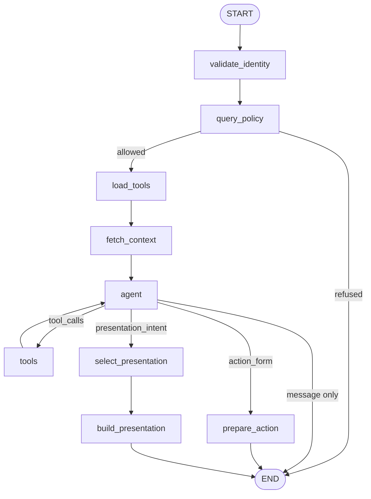

`nodes.route_after_agent` picks the branch in one fixed precedence — tool calls,
then a form, then a presentation intent, then `END` — and every protocol value
it reads was re-normalized first (`a2ui_actions/forms.py:normalize_form_name`,
`services/financial_presentation/intents.py:normalize_action_intent`), so a
hallucinated name becomes "no branch" rather than an unchecked call.

The policy branch classifies only scope/safety, never financial intent. The
remaining topology makes each business outcome reachable without selecting it.
Flows 2, 3 and 4 are the three product flows those branches compose.

---

## 2. Information flow

`query -> agent reasoning -> search_tools when needed -> 1..N tools -> execute
-> interpret -> A2UI`

The default path for "¿Cuánto dinero tengo?" and "¿En qué gasté este mes?".

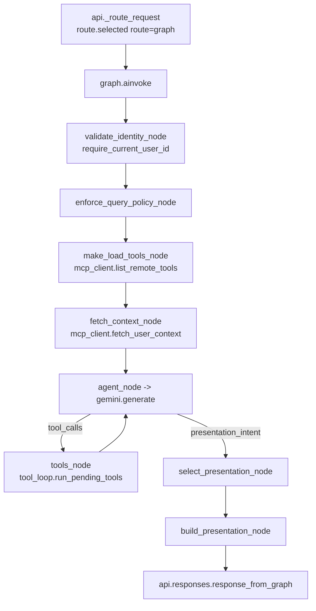

Modules: `api/__init__.py`, `agent/nodes.py`, `agent/gemini.py`,
`agent/tool_loop.py`, `services/financial_presentation/`.

The model decides whether data is needed at all, which capabilities provide it,
how many, and whether the turn ends in a presentation or plain prose. It selects
a `presentation_intent` from the 13-value vocabulary; it never renders a figure.

Invariants: identity is validated before any load or read; `fetch_context_node`
retains the scoped rows it read so a later domain read does not fetch them
again; a failed context produces `nodes.FALLBACK_PROFILE`, which carries **no**
balances, and the agent answers without figures (flow 10). An explicitly
requested view (`requested_intent`, set only by flow 9) outranks the model's
own choice.

---

## 3. Direct action flow

`query -> agent reasoning -> prepare action -> A2UI form
-> explicit user interaction -> MCP execution -> updated state -> updated A2UI`

"Crea un presupuesto" needs no data first: the model answers with
`action_form`, and MCP is asked to *prepare* — never to save.

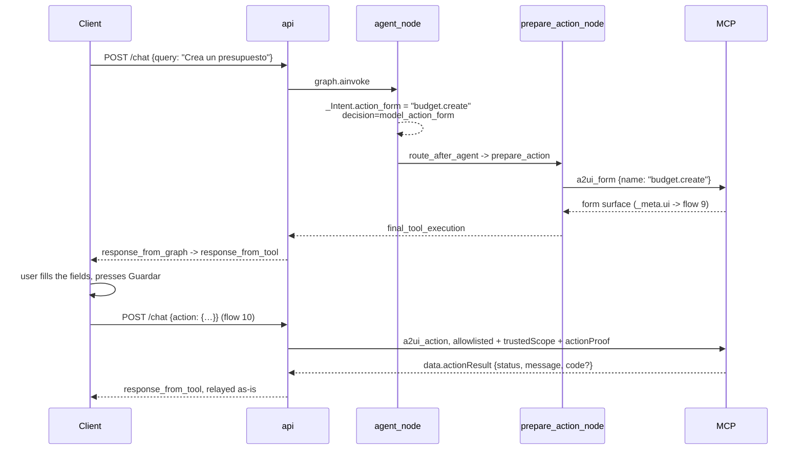

Modules: `agent/gemini.py:_Intent.action_form`, `a2ui_actions/forms.py`,
`agent/nodes.py:make_prepare_action_node`, `api/actions.py`.

The vocabulary is the four names `a2ui_form` accepts — `budget.create`,
`budget.load`, `savings_goal.create`, `savings_goal.load`
(`ACTION_FORM_NAMES`). It is declared to Gemini as an enum (`_ActionForm`) and
re-validated by `normalize_form_name` both in `route_after_agent` and inside
`prepare_action_node`, so a name outside the set can only become "no form".
`.update` is deliberately absent: MCP derives an update form from the matching
`.load`.

Invariants: preparing a form is not performing its write — `a2ui_form` reads
current values and returns a surface, and only a later user Button event reaches
an action handler (flow 10). The model never receives `a2ui_action`.

---

## 4. Action-with-data flow

`query -> agent reasoning -> search_tools -> 1..N tools -> interpret results
-> prepare action -> A2UI form -> explicit user interaction -> MCP execution
-> updated state -> updated A2UI`

The same as flow 3, except the model reads data first — "ajusta mi presupuesto
a lo que realmente gasto" needs `analyze_spending` (and possibly
`get_budget_progress`) before a form is worth preparing. Mechanically it is
flow 2's tool loop followed by flow 3's `prepare_action`, because the graph lets
the `agent` node reach either branch from the same state:

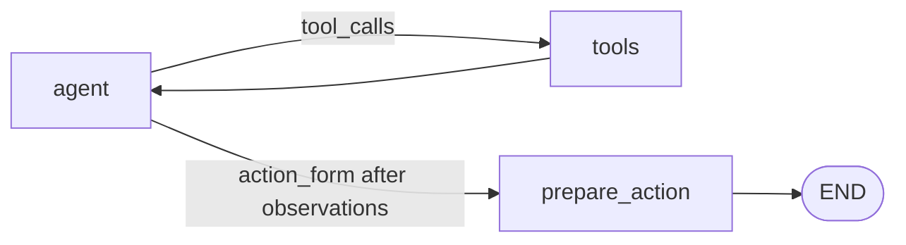

The prompt says so explicitly: ask for data with the tools first only if
something is missing; if the context is already there, prepare the form
directly. Nothing in the graph forces a tool round trip before a form, and
nothing forbids one.

---

## 5. Tool discovery and multi-tool selection

Before this flow, every plain query passes through `nodes.query_policy`. The
model-free gate returns a fixed refusal for prompt injection, instruction
disclosure/override attempts, executable scripts or code, historical
narration, and non-banking content. A denial reaches `END` before tool schemas,
user context, MCP, or the model are loaded. It selects no financial intent, so
accepted banking traffic still follows the discovery flow below.

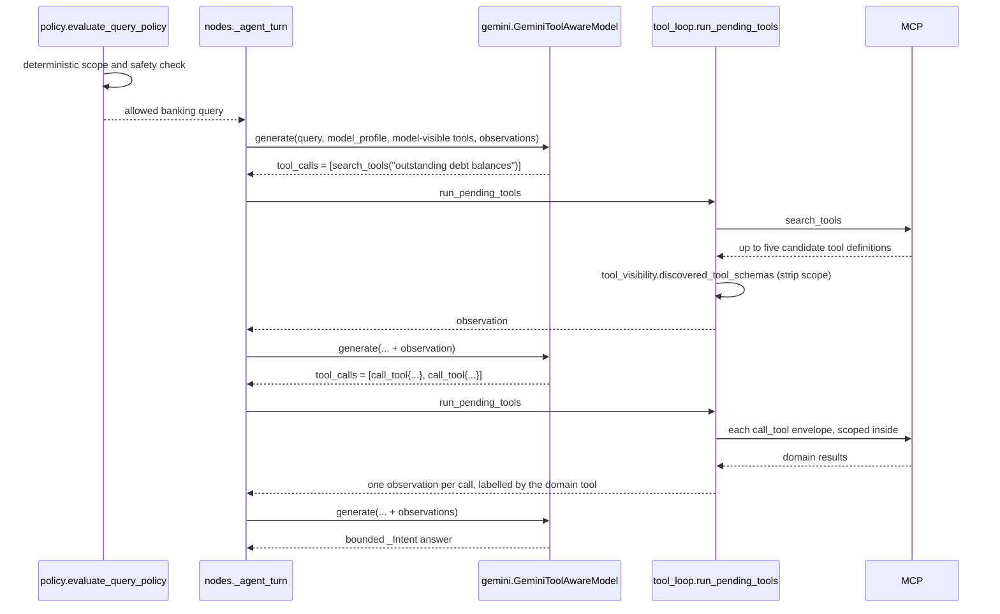

Modules: `agent/nodes.py`, `agent/gemini.py`, `agent/tool_visibility.py`,
`agent/tool_loop.py`, `mcp_client/trusted_scope.py:resolve_tool_call`.

**Multi-tool selection is the model's decision.** `search_tools` returns several
ranked candidates and the prompt tells the model to evaluate them and call as
many as the question genuinely needs. One iteration of the loop executes all the
calls it was handed; `gemini.MAX_CALLS_PER_TURN` (6) only stops a runaway
fan-out. `nodes.MAX_TOOL_TURNS` (8) bounds the number of iterations.

**Search queries are English.** The MCP catalog is English-only and BM25 is
lexical, so the prompt asks the model to translate the user's Spanish intent
into an English query (`"spending by category"`, not `"gastos por categoría"`).
MCP additionally folds Spanish domain words onto English catalog vocabulary on
the query side only (`hackmty2026-mcp/src/supabase_mcp/discovery.py`), so a
Spanish query still retrieves; the prompt instruction is what makes ranking
good rather than merely non-zero.

Invariants: the model is offered only what the server declares model-visible —
under progressive discovery the two synthetic tools, never the 15 financial
schemas. Schemas returned by `search_tools` are stripped of their trusted
`scope` fields before the model sees them. `resolve_tool_call` unwraps the
envelope (including the re-wrapped and wrapper-dropped variants Gemini emits) so
scoping, logging and routing all reason about the inner domain tool. Repeating
an identical successful search is skipped (`observations.already_searched`).

What the model sees of the *user* is one field: `gemini.model_profile` projects
`UserProfile` down to `literacy_level`. Balances, overdraft risk, recurring
expenses and appearance preferences never enter a prompt — the trusted builder
renders every figure from MCP observations, and the client owns appearance.

---

## 6. MCP tool execution loop

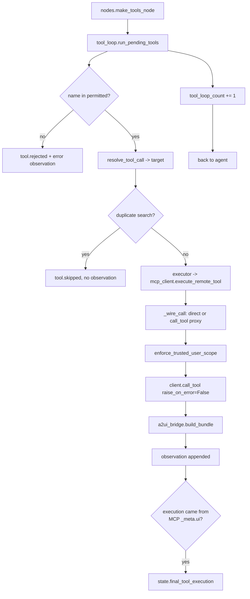

Modules: `agent/tool_loop.py`, `mcp_client/execution.py`,
`mcp_client/trusted_scope.py`, `services/a2ui_bridge.py`.

Invariants: two independent permission sources — the model may only use
model-visible advertised tools, the deterministic planner only scoped financial
capabilities that are directly advertised or addressable through the advertised
`call_tool` proxy. Every call that runs produces an observation, success or failure,
so a later stage can distinguish "MCP said nothing" from "MCP was never asked".
`raise_on_error=False` keeps sanitized error results instead of turning them
into generic transport failures. The loop is bounded by
`nodes.MAX_TOOL_TURNS` (8).

---

## 7. Provenance and final validation

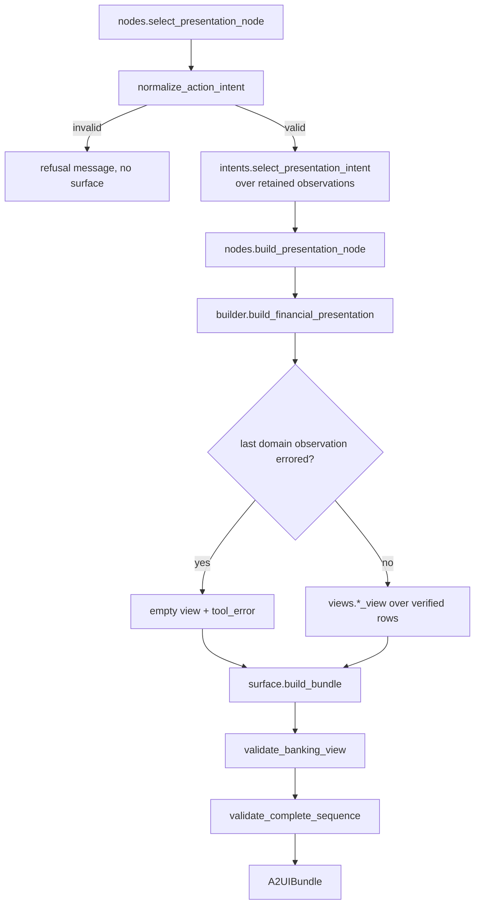

Modules: `agent/nodes.py`, `agent/observations.py:retained_observations`,
`services/financial_presentation/{intents,verified_rows,views,builder,surface}.py`,
`schemas/banking_view.py`, `schemas/a2ui.py`.

`select_presentation_intent` is the one remaining refinement, and it is not a
classifier: a `transactions` request phrased as a spending question is upgraded
to `spending-analysis` only once the rows to analyse are actually present, and
never when `action_requested` pinned the intent.

Invariants: only observations reach the views, and only through
`verified_rows.rows_for_table`, which skips errored observations and drops rows
that fail their contract checks. An unverifiable or mixed-currency dataset
renders an explicit empty view rather than an estimate. Every surface is
validated twice — as a Finance v2 view and as a complete v0.9.1 sequence —
before it can leave.

---

## 8. Finance v2 presentation generation

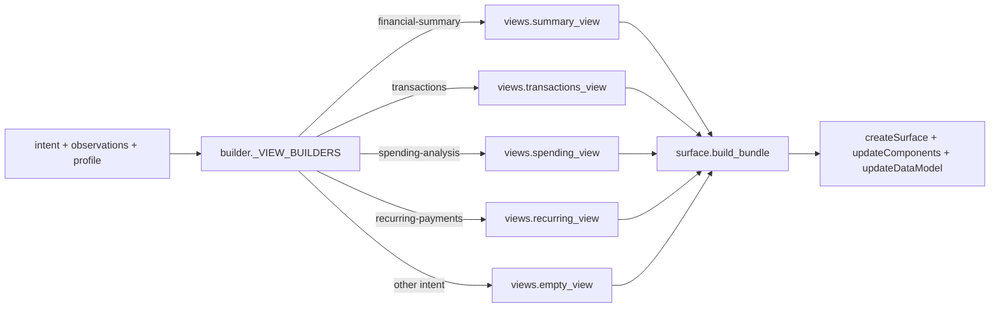

Modules: `services/financial_presentation/views.py`,
`services/financial_presentation/surface.py`.

`spending_view` prefers `analyze_spending`'s chart-ready aggregates
(`_spending_from_domain_result`) and falls back to aggregating verified
transaction rows itself (`_spending_from_transactions`). Database categories
collapse onto the visual categories and are summed before the view is built,
because the contract allows one row per visual category.

Invariants: the component tree, surface id, catalog id and action name are
constants in `surface.py` — Gemini never generates or edits raw A2UI. This is
the surface the client renders for the flow-2 path, and it is built entirely
in-process: no `resources/read`, and MCP's `present_financial_view` /
`a2ui://finance/view` resource is not involved. Every component carries an
`accessibility.label` bound to `/viewLabel` or `/actionLabel`, mirroring
MCP's own `templates/financial_view.json` so the cross-repo parity guard stays
meaningful. The one follow-up button dispatches `request_financial_view` with an
intent from the finite vocabulary. `financial-summary` shows masked cards (last
four only) and only for accounts included in that same summary.

---

## 9. MCP-produced A2UI bridge path

Used by anything that owns its own surface: `database_overview`,
`visualize_allowed_data`, and the `a2ui_form` surfaces of flows 3 and 4.

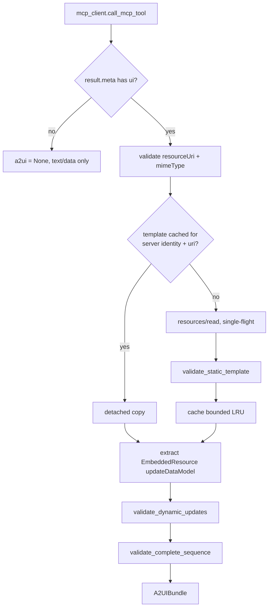

Modules: `mcp_client/execution.py:call_mcp_tool`, `services/a2ui_bridge.py`,
`schemas/a2ui.py`.

Invariants: the bridge branches on `_meta.ui`, never on tool names. A rejected
or failed presentation degrades to `a2ui=None` with `presentation_error=True`,
keeping the MCP text and structured data. The cache is keyed by MCP server
identity plus resource URI, holds only validated static templates, never
`updateDataModel` data or banking rows, returns detached copies, and coalesces
concurrent reads. Static messages are still included in every response because
Mobile treats each response as a self-contained replacement.

---

## 10. A2UI action transport and re-entry

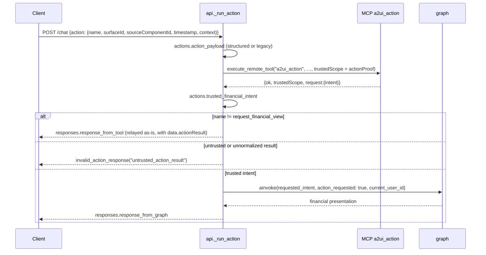

Modules: `api/__init__.py:_run_action`, `api/actions.py`,
`schemas/a2ui_action.py`, `mcp_client/trusted_scope.py`.

Invariants: actions never enter the LLM. The trusted UUID travels in a separate
`trustedScope` field, never in the A2UI context, and is signed server-side with
an HMAC `actionProof` that a client cannot forge. Re-entry requires all of: MCP
reported success, it echoed a trusted scope naming *this* authenticated user,
and the intent is one of the shared contract's. `action_requested=True` also
pins `select_presentation_intent` to the requested intent, so an explicit action
is never silently upgraded to a different view. `request_financial_view` is the
only name that re-enters the graph; the budget and savings-goal writes of flows
3 and 4 are relayed straight back as `data.actionResult`, which is how the
client learns that HTTP 200 did or did not mean "saved".

---

## 11. Lifecycle progress events

`POST /api/v1/agent/chat/stream` answers `application/x-ndjson` with one JSON
object per line: zero or more `{"type":"agent_status","status":"<id>"}`, then
exactly one `{"type":"result","result":{<ChatResponse>}}`. `POST
/api/v1/agent/chat` is unchanged and returns that envelope alone.

The vocabulary is exactly eight ids, declared in `agent/status.py`:

| Status id | Emitted by |
| --- | --- |
| `interpreting` | `validate_identity_node`; `agent_node` before its first model turn |
| `discovering_tools` | `tools_node` when a pending call is `search_tools` |
| `selecting_tools` | `agent_node` when the last observation came from `search_tools` |
| `executing_tools` | `tools_node` for domain calls |
| `interpreting_results` | `agent_node` when domain observations are present |
| `preparing_action` | `prepare_action_node`, before `a2ui_form` |
| `building_ui` | `build_presentation_node`; `prepare_action_node` after MCP answers |
| `validating_ui` | either of those two, once a bundle exists |

Transport is LangGraph's custom stream channel
(`langgraph.config.get_stream_writer` inside a node, consumed with
`graph.astream(stream_mode=["custom","values"])`).
`api/__init__.py:_status_line` is the security boundary: it allowlists the
payload, so a node cannot widen the channel into a reasoning one — only the
discriminator and a known id are ever forwarded. `emit_status` is a no-op when
nobody is streaming, so `/chat` and the tests run the graph unchanged.

Consecutive duplicate ids are possible and mean one state; `interpreting` is
emitted twice on a normal turn. The status ids carry no prompt text, reasoning,
tool names, arguments or rows. **User-facing copy is client-owned** and lives in
one map in the mobile repo,
`HackMTY2026_Mobile/src/features/assistant/agent-status.ts`; nothing in this
repository should be edited to change what the user reads.

A structured action turn is not streamed phase by phase — it is dispatched
through `_route_request` like `/chat` and reported as a single `result` line.

---

## 12. Bounded conversational and unsupported requests

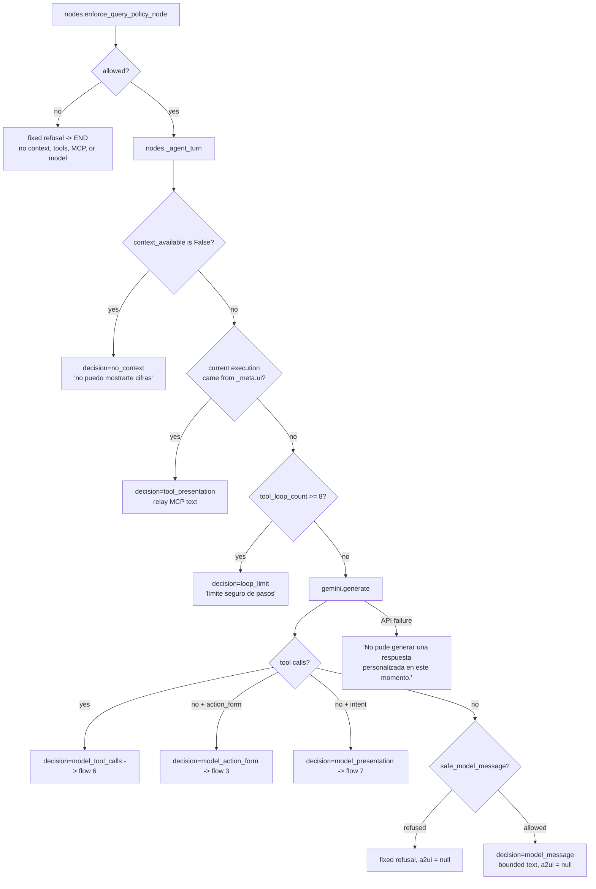

Modules: `agent/policy.py`, `agent/nodes.py:enforce_query_policy_node`,
`_agent_turn` and `_from_model_turn`, `agent/gemini.py`, and
`api/responses.py` for the final all-path prose check.

Invariants: a chat answer carries no surface (`a2ui: null`) and no invented
figures. A missing user context is reported as such rather than filled with a
fallback balance. A Gemini failure in the tool phase still lets the answer phase
run; a failure in the answer phase falls back to a fixed message and leaves the
deterministic policies available. A recognised financial intent reaches the
trusted Finance v2 builder only after its required MCP attempt is retained; an
unavailable capability ends with a bounded message and no surface rather than a
view without provenance. Prohibited prose is replaced, never partially cleaned
or returned alongside the original content.

---

## Reading a turn in the logs

Stage names are stable and grep-friendly; the mapping to this document:

| Stage / event | Flow |
| --- | --- |
| `http.auth`, `http.identity_mismatch` | preamble |
| `route.selected` (`route=graph`, `graph_stream`, `action`, `action_graph`) | preamble, 10, 11 |
| `graph.invoke`, `graph.stream` | preamble, 11 |
| `node.load_tools`, `node.fetch_context` | 2 |
| `node.agent` + `decision=` | 2, 5, 12 |
| `model.gemini` | 2, 5, 12 |
| `node.tools`, `tool.call`, `tool.rejected`, `tool.skipped`, `tool.failed` | 6 |
| `mcp.connect`, `mcp.list_tools`, `mcp.user_context`, `mcp.call`, `mcp.tools_cache`, `mcp.a2ui_bridge` | 2, 6, 9 |
| `a2ui.template`, `a2ui.resource_read` | 9 |
| `node.prepare_action` | 3, 4 |
| `node.select_presentation`, `node.build_presentation` | 7, 8 |
| `route.action` | 10 |
| `graph.route`, `graph.output`, `client.response` | all |

`node.agent` `decision=` values are `no_context`, `tool_presentation`,
`loop_limit`, `model_tool_calls`, `model_action_form`, `model_presentation` and
`model_message`. There is no `decision=financial_retrieval` or
`decision=financial_ready`, and no `route.selected route=database_overview` or
`route=action_form`: those belonged to the deleted deterministic router.
