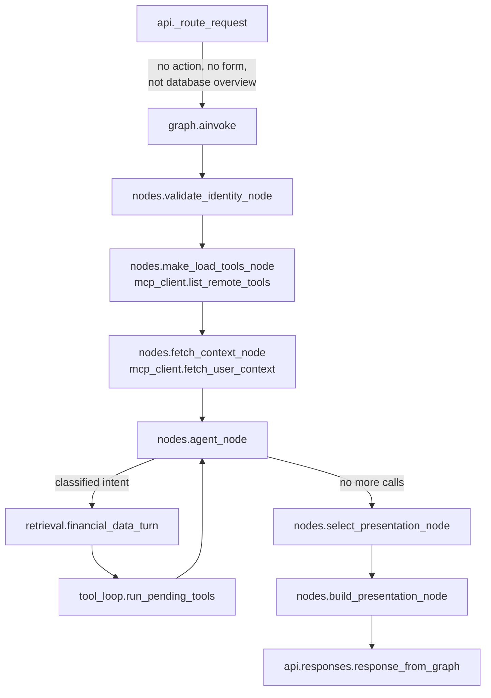
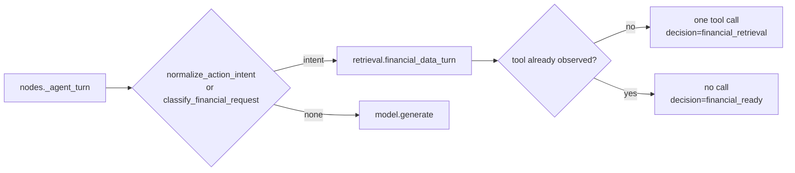
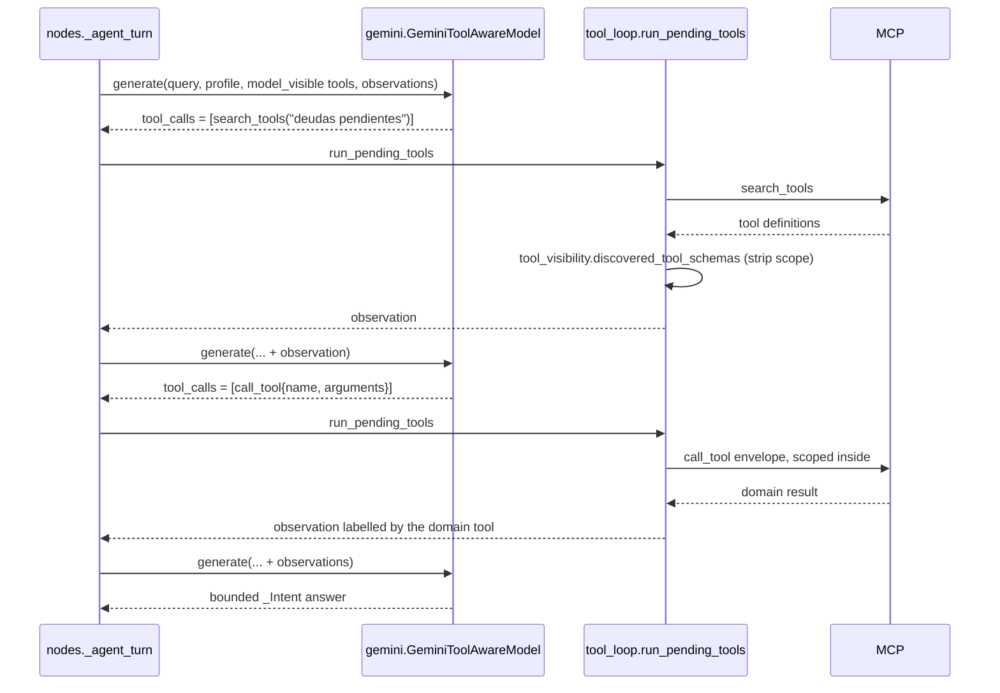
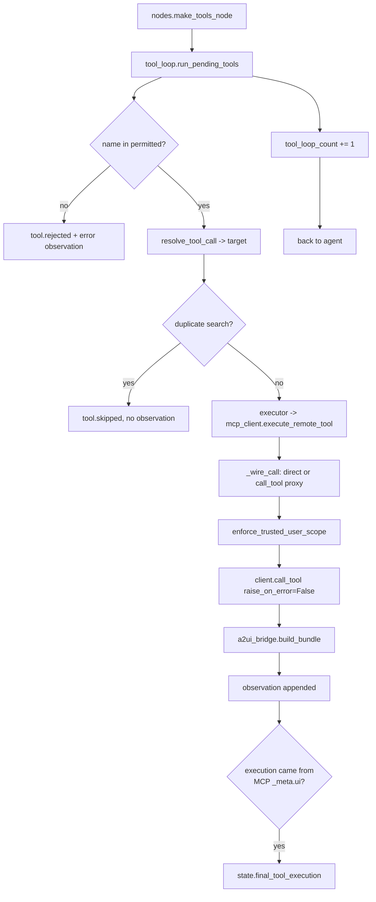
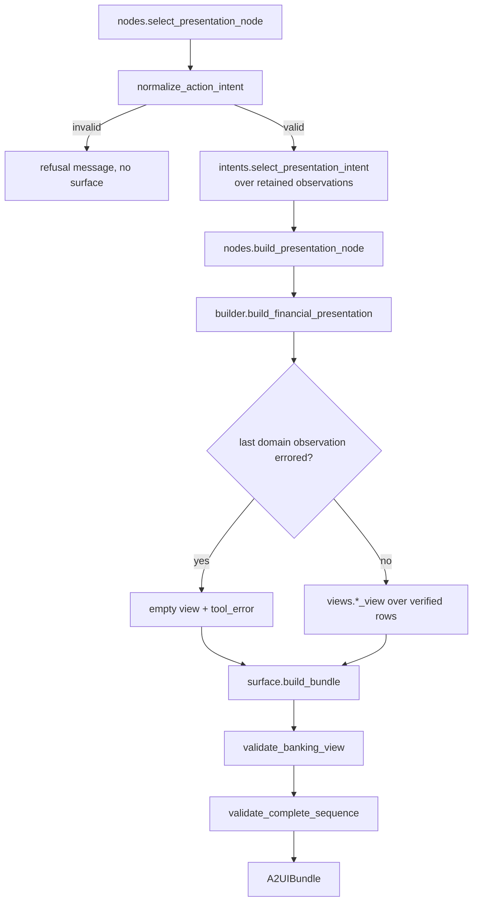
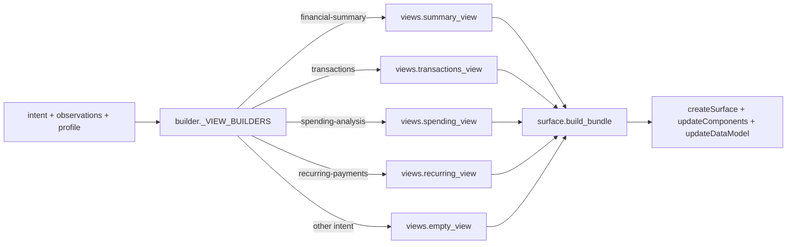
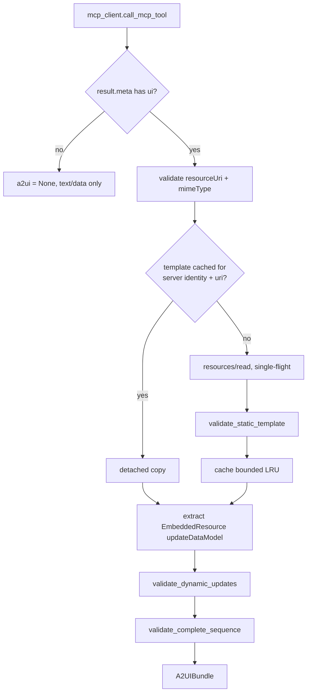
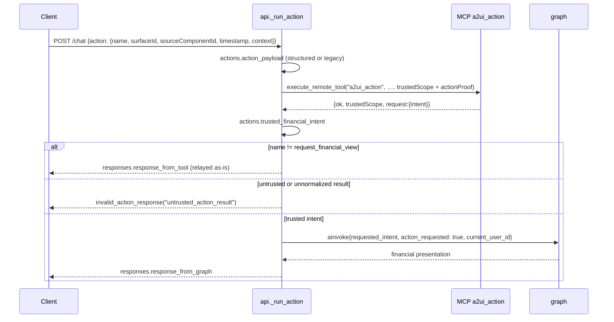
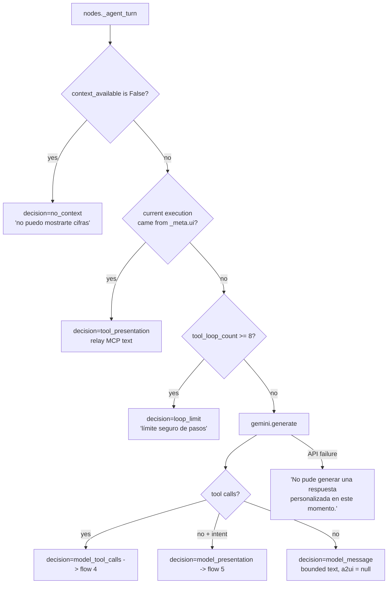

# Flows

The paths a request actually takes today, with the modules and functions that
implement each one. For where code lives and why, see
[ARCHITECTURE.md](ARCHITECTURE.md).

Every flow starts the same way, so it is stated once here rather than repeated:

`api/__init__.py:chat` opens the turn (`observability.start_turn`), then
`_handle_chat` verifies the bearer token through
`auth.verify_supabase_access_token`, refuses a body `user_id` that disagrees
with it (403), parses any action form via `api/actions.py:action_payload`, and
opens **one** MCP session for the whole turn
(`mcp_client/session.py:mcp_session`) before calling `_route_request`.

**Invariant for all flows:** `current_user_id` comes from the token and nothing
else, and `mcp_client/trusted_scope.py:enforce_trusted_user_scope` overwrites
every identity field on every scoped call regardless of what produced the
arguments. The first graph node also overwrites every turn-scoped call,
observation, intent, and presentation channel so checkpointed state from an
earlier request cannot route the new turn.

---

## 1. Normal authenticated financial query

The default path for "¿Cuánto dinero tengo?".

Modules: `api/__init__.py`, `agent/nodes.py`, `agent/retrieval.py`,
`agent/tool_loop.py`, `services/financial_presentation/`.

Invariants: identity is validated before any load or read; `fetch_context_node`
retains the scoped rows it read so a later domain read does not fetch them
again; a failed context produces the fallback profile with **no** balances, and
the agent answers without figures.

---

## 2. Deterministic financial fast path

The branch inside flow 1 that never reaches Gemini.

Modules: `agent/nodes.py:_agent_turn`,
`services/financial_presentation/intents.py:classify_financial_request`,
`agent/retrieval.py`.

`retrieval.financial_data_turn` maps the intent to exactly one capability
(`_TOOL_BY_INTENT`, refined for statements/beneficiaries/alerts), adds bilingual
query refinements (`period`, `merchant_query`, `category`, `days_ahead`), and
returns at most one call. `debts` + a comparison phrase reads
`get_debt_overview` first and only then `compare_debt_scenarios`, using a debt
id from this user's own overview.

Invariants: no `search_tools` round trip, no model turn, no `model.gemini` stage
in the log — `decision=financial_retrieval` with nothing after it *is* the fast
path. The capability set is the scoped-execution boundary, never the set of
schemas the model was handed.

---

## 3. Unclassified request using `search_tools -> call_tool`

Modules: `agent/nodes.py`, `agent/gemini.py`, `agent/tool_visibility.py`,
`agent/tool_loop.py`, `mcp_client/trusted_scope.py:resolve_tool_call`.

Invariants: the model is offered only what the server declares model-visible —
under progressive discovery, the two synthetic tools, never the 15 financial
schemas. Schemas returned by `search_tools` are stripped of their trusted
`scope` fields before the model sees them. `resolve_tool_call` unwraps the
envelope (including the re-wrapped and wrapper-dropped variants Gemini emits) so
scoping, logging and routing all reason about the inner domain tool. Repeating
an identical successful search is skipped (`observations.already_searched`).

---

## 4. MCP tool execution loop

Modules: `agent/tool_loop.py`, `mcp_client/execution.py`,
`mcp_client/trusted_scope.py`, `services/a2ui_bridge.py`.

Invariants: two independent permission sources — the model may only use
model-visible advertised tools, the deterministic planner only scoped financial
capabilities that are directly advertised or addressable through the advertised
`call_tool` proxy. Every call that runs produces an observation, success or failure,
so a later stage can distinguish "MCP said nothing" from "MCP was never asked".
`raise_on_error=False` keeps sanitized error results instead of turning them
into generic transport failures. The loop is bounded by
`nodes.MAX_TOOL_TURNS` (8).

---

## 5. Provenance and final validation

Modules: `agent/nodes.py`, `agent/observations.py:retained_observations`,
`services/financial_presentation/{intents,verified_rows,views,builder,surface}.py`,
`schemas/banking_view.py`, `schemas/a2ui.py`.

Invariants: only observations reach the views, and only through
`verified_rows.rows_for_table`, which skips errored observations and drops rows
that fail their contract checks. An unverifiable or mixed-currency dataset
renders an explicit empty view rather than an estimate. Every surface is
validated twice — as a Finance v2 view and as a complete v0.9.1 sequence —
before it can leave.

---

## 6. Finance v2 presentation generation

Modules: `services/financial_presentation/views.py`,
`services/financial_presentation/surface.py`.

`spending_view` prefers `analyze_spending`'s chart-ready aggregates
(`_spending_from_domain_result`) and falls back to aggregating verified
transaction rows itself (`_spending_from_transactions`). Database categories
collapse onto the visual categories and are summed before the view is built,
because the contract allows one row per visual category.

Invariants: the component tree, surface id, catalog id and action name are
constants in `surface.py` — Gemini never generates or edits raw A2UI. The one
follow-up button dispatches `request_financial_view` with an intent from the
finite vocabulary. `financial-summary` shows masked cards (last four only) and
only for accounts included in that same summary.

---

## 7. MCP-produced A2UI bridge path

Used by domain tools that own their own surface, such as `database_overview`.

Modules: `mcp_client/execution.py:call_mcp_tool`, `services/a2ui_bridge.py`,
`schemas/a2ui.py`.

Invariants: the bridge branches on `_meta.ui`, never on tool names. A rejected
or failed presentation degrades to `a2ui=None` with `presentation_error=True`,
keeping the MCP text and structured data. The cache is keyed by MCP server
identity plus resource URI, holds only validated static templates, never
`updateDataModel` data or banking rows, returns detached copies, and coalesces
concurrent reads. Static messages are still included in every response because
Mobile treats each response as a self-contained replacement.

---

## 8. A2UI action re-entry

Modules: `api/__init__.py:_run_action`, `api/actions.py`,
`schemas/a2ui_action.py`, `mcp_client/trusted_scope.py`.

Invariants: actions never enter the LLM. The trusted UUID travels in a separate
`trustedScope` field, never in the A2UI context, and is signed server-side with
an HMAC `actionProof` that a client cannot forge. Re-entry requires all of: MCP
reported success, it echoed a trusted scope naming *this* authenticated user,
and the intent is one of the shared contract's. `action_requested=True` also
pins `select_presentation_intent` to the requested intent, so an explicit
action is never silently upgraded to a different view.

Two plain-text queries also bypass the graph before it is ever invoked
(`api/query_routing.py`): a form request
(`a2ui_actions/routing.py:requested_form` → MCP `a2ui_form`, which saves
nothing) and a database-metadata request (`requests_database_overview` → MCP
`database_overview`, relayed through flow 7).

---

## 9. Bounded conversational and unsupported requests

Modules: `agent/nodes.py:_agent_turn` and `_from_model_turn`,
`agent/gemini.py`.

Invariants: a chat answer carries no surface (`a2ui: null`) and no invented
figures. A missing user context is reported as such rather than filled with a
fallback balance. A Gemini failure in the tool phase still lets the answer phase
run; a failure in the answer phase falls back to a fixed message and leaves the
deterministic policies available. A recognised financial intent reaches the
trusted Finance v2 builder only after its required MCP attempt is retained; an
unavailable capability ends with a bounded message and no surface rather than a
view without provenance.

---

## Reading a turn in the logs

Stage names are stable and grep-friendly; the mapping to this document:

| Stage / event | Flow |
| --- | --- |
| `http.auth`, `route.selected` | preamble, 8 |
| `node.load_tools`, `node.fetch_context` | 1 |
| `node.agent` + `decision=` | 2, 3, 9 |
| `model.gemini` | 3, 9 |
| `node.tools`, `tool.call`, `tool.rejected`, `tool.skipped` | 4 |
| `mcp.call`, `mcp.a2ui_bridge`, `a2ui.template`, `a2ui.resource_read` | 4, 7 |
| `node.select_presentation`, `node.build_presentation` | 5, 6 |
| `graph.route`, `graph.output`, `client.response` | all |
